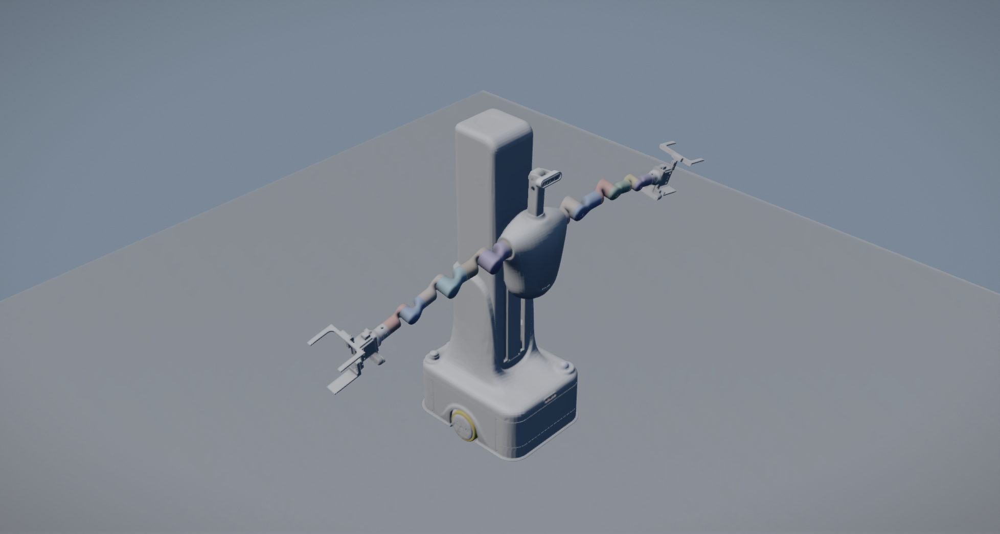

# Isaac Robot Simulation

[中文](README.zh-CN.md) · [Operations](docs/getting-started.md) · [Validation](reports/VALIDATION_20260916.md)

Isaac Sim 5.1 / ROS 2 Jazzy / OCS2 framework for R1 dual-arm and gripper
teleoperation, differential base control, three RGB-D cameras and local LeRobot exports.

## OmniSim branch: motion validation



Native OmniSim screenshot after commanding the tested arm/finger pose.
**Fixed-base simple motion: PASS (5/5 phases).** Four arm joints and four finger
joints showed measured movement within the declared endpoint tolerances.
This is not a grasp or full sim-to-sim equivalence claim.

[sim2sim setup and records](sim2sim/README.md) · [Validation claim](sim2sim/CLAIM.md)

## Start here

- **Project introduction and layout:** [Overview](docs/overview.md)
- **Installation and operation:** [Getting started](docs/getting-started.md)
- **Command entry:** `./run.sh` in the repository root (no arguments show help)
- **Documentation:** [Index](docs/README.md)

| Task | Command |
| --- | --- |
| Simulation only | `./run.sh start-isaac` |
| Teaching and recording | `./run.sh sim1-session --name my_episode` |
| Convert existing data | `./run.sh sim1-process outputs/sessions/my_episode/trace.csv --with-v21` |

## Quick start

```bash
git lfs install
git lfs pull
python3 scripts/prepare_portable_urdf.py
export ISAAC_SIM_ROOT=/path/to/isaac-sim-standalone-5.1.0-linux-x86_64
source scripts/activate_sim1_conda.sh
./run.sh preflight
./run.sh sim1-session --name my_episode
```

Install/build prerequisites first: [English](docs/getting-started.md),
[中文](docs/getting-started.zh-CN.md), [Conda/ROS dependencies](dependencies/CONDA_SIM1_JAZZY.md).
The session starts Play, OCS2, pygame recording and all six camera previews.
Press Q in pygame to finalize. Outputs: `outputs/sessions/my_episode/`.
The simulator installation is external; asset and source paths are repository-relative.

## Validation status

The full scene and ROS Bridge run. Root USD metadata is Z-up/metres; bridge
registration is completed before scene loading. Pygame is the only arm target
publisher in a teaching session. Six RGB/depth streams and actual base/joint
feedback were recorded. Small-motion OCS2 tracking and local LeRobot v2.1/v3.0
exports were checked; see the measured limits in the [report](reports/VALIDATION_20260916.md).
Depth is retained as lossless auxiliary arrays; the standard video features are
three RGB streams. Official LeRobot training-loader integration and physical
hardware transfer are not claimed.

The 2026-09-16 core is [frozen with file hashes and a source snapshot](releases/naming-v3/FREEZE.md).
Both local export formats passed validation (131 frames, 20 FPS). The last
automatic-base command fix was not re-recorded; its verification limit is retained
in the report.

```bash
./run.sh sim1-process outputs/sessions/my_episode/trace.csv --with-v21
```

## Layout

| Directory | Purpose |
| --- | --- |
| `assets/` | LFS scene and model assets |
| `projects/ros2_ws/src/` | ROS / OCS2 source packages |
| `projects/teleoperation/sim1/` | teaching, cleaning, export and replay |
| `projects/physics_parameters/` | Optional physics parameter experiments |
| `run.sh` | Public command entry |
| `scripts/` | stable launch, validation and asset preparation |
| `dependencies/` | pinned external dependencies |
| `docs/`, `reports/` | current operation, historical evidence and validation |
| `evaluations/omnisim/` | isolated cross-simulator tests |
| `releases/` | freeze manifest and integrity checks |
| `outputs/`, `.runtime/` | ignored local data, logs and dependencies |

Canonical robot source: `projects/ros2_ws/src/robot`.
The ROS URDF uses package URIs; `r1_fixed_portable.urdf` uses relative mesh paths.
A source ZIP or LFS pointer is not a complete geometry asset. Use a hydrated clone.
Optional IsaacLab-Arena is not a core dependency. Historical notes remain labelled
and indexed; use the current operation guide for commands.

## Cross-simulator validation

See [the isolated evaluation](evaluations/omnisim/README.md). The email's LFS
pointer and ROS package-URI issues were reproduced and addressed. OmniSim 8.5.1
also requires a fixed-parent compatibility variant; normal ROS/Isaac imports keep
the original kinematic description. Fixed gripper-cycle measurements, contact
queries, versions and limitations are reported there. Successful import or finger
motion is not evidence of a completed object grasp.
Measured gripper closing error was 1.803–1.859 mm. A cube/floor control also failed
without R1, so object-contact and grasp validation remain unresolved in this build.

## Earlier simulation demos

[Part 1](docs/demo/test_part1.mp4) · [Part 2](docs/demo/test_part2.mp4)

These historical demonstrations are separate from this machine's validation data.
