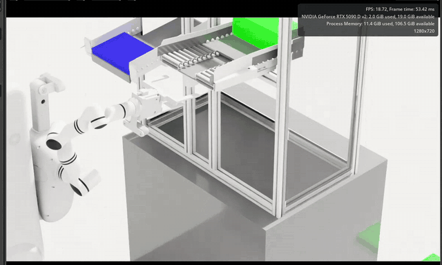
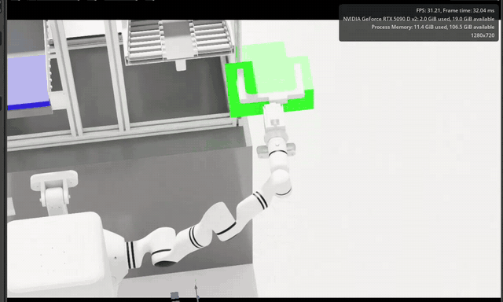

# Isaac Robot Simulation（中文）

[English](README.md) · [操作指南](docs/getting-started.zh-CN.md) · [验证报告](reports/VALIDATION_20260916.md)

基于 Isaac Sim 5.1、ROS 2 Jazzy 与 OCS2 的 R1 双臂/夹爪、差速底盘示教工程，
包含头部和双腕三组 RGB-D 相机、六路采集及本地 LeRobot 转换。

## 仿真演示

以下为原始演示的精选片段，裁切至仿真视口并以 **4 倍速**播放。点击预览可打开完整视频。

[](docs/demo/test_part1.mp4)

[](docs/demo/test_part2.mp4)

## 从这里开始

- **项目介绍与目录说明**：[项目介绍](docs/overview.zh-CN.md)
- **安装、启动和操作**：[使用指南](docs/getting-started.zh-CN.md)
- **统一命令入口**：根目录 `./run.sh`（无参数显示帮助）
- **所有文档**：[文档导航](docs/README.md)

| 需求 | 命令 |
| --- | --- |
| 只打开场景并开始仿真 | `./run.sh start-isaac` |
| 示教与六路录制 | `./run.sh sim1-session --name my_episode` |
| 转换已有录制 | `./run.sh sim1-process outputs/sessions/my_episode/trace.csv --with-v21` |

## 快速启动

```bash
git lfs install
git lfs pull
python3 scripts/prepare_portable_urdf.py
export ISAAC_SIM_ROOT=/path/to/isaac-sim-standalone-5.1.0-linux-x86_64
source scripts/activate_sim1_conda.sh
./run.sh preflight
./run.sh sim1-session --name my_episode
```

先按[操作指南](docs/getting-started.zh-CN.md)和[依赖说明](dependencies/CONDA_SIM1_JAZZY.md)
安装依赖、构建工作区。统一入口启动 Play、OCS2、pygame 录制和六路预览。
在 pygame 按 Q 结束，输出位于 `outputs/sessions/my_episode/`。
仿真器安装目录由环境变量指定，工程资产与源码使用仓库相对位置。

## 验证状态

完整场景和 ROS Bridge 已运行。便携 USD 保留 Z-up/米单位，ROS 扩展注册完成后
再加载场景。示教时 pygame 为唯一末端目标发布源。六路 RGB/深度、实际关节与
底盘反馈已录制，并检查小幅运动及 LeRobot v2.1/v3.0 本地导出。
具体测量和边界见[报告](reports/VALIDATION_20260916.md)。三路 RGB 为标准视频特征，
深度无损保留为辅助数组。尚未验证官方 LeRobot 训练加载器或实体硬件迁移。

2026-09-16 核心已[冻结并保存文件校验值与源码快照](releases/naming-v3/FREEZE.md)。
两种导出格式均通过本地校验（131 帧、20 FPS）。自动底盘指令最后的修正未重新
录制，验证边界已保留在报告中。

```bash
./run.sh sim1-process outputs/sessions/my_episode/trace.csv --with-v21
```

## 工程结构

| 目录 | 内容 |
| --- | --- |
| `assets/` | LFS 场景与模型资产 |
| `projects/ros2_ws/src/` | ROS / OCS2 源码 |
| `projects/teleoperation/sim1/` | 示教、清洗、转换、回放 |
| `projects/physics_parameters/` | 独立物理参数研究 |
| `run.sh` | 面向用户的命令入口 |
| `scripts/` | 启动、验证、资产准备入口 |
| `dependencies/` | 依赖清单 |
| `docs/`、`reports/` | 当前操作说明与历史证据 |
| `evaluations/omnisim/` | 独立跨仿真器测试 |
| `releases/` | 冻结清单与校验 |
| `outputs/`、`.runtime/` | 不提交的本机数据、日志、依赖 |

机器人唯一源码为 `projects/ros2_ws/src/robot`。ROS URDF 保留 package URI，
`r1_fixed_portable.urdf` 使用相对网格路径。ZIP 源码包或 LFS 指针不包含完整几何。
IsaacLab-Arena 为可选组件。历史记录保留日期标识，执行命令以当前操作指南为准。

## Cross-simulator validation / 跨仿真器验证

见[独立测试目录](evaluations/omnisim/README.md)。OmniSim 8.5.1 需要固定父链兼容变体；
ROS/Isaac 继续使用原始运动学描述。夹爪固定周期、接触查询、版本和测试限制
均保留实测结果。模型能导入或夹爪能移动不等于已完成物体抓取。
夹爪闭合误差实测 1.803–1.859 mm；移除 R1 后的方块/地面对照仍失败，
当前构建的物体接触与抓取验证尚未解决。

## 历史演示

[第一部分](docs/demo/test_part1.mp4) · [第二部分](docs/demo/test_part2.mp4)

历史演示与本机新增验证数据分别记录。
