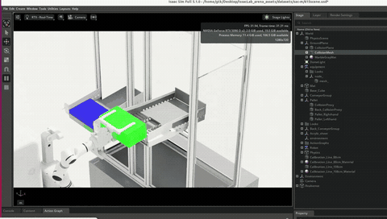
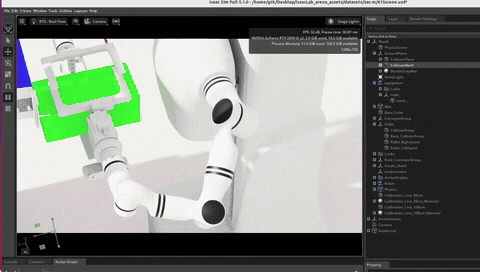

# Isaac OCS Project（中文说明）

## 项目简介

本工程是 Isaac Sim 5.1.0、ROS 2、OCS2 和 SIM1 双臂/夹爪/底盘仿真项目的可迁移工作副本。唯一仿真入口是 `assets/scenes/scene.usd`；`assets/scenes/615scene_20260723/` 是它的依赖层，不是第二个启动场景。

## 仿真演示视频

下面是 Isaac Sim 中机械臂与仿真场景交互的两段动图演示。点击动图可观看完整录像。

### 第一部分 · 8 分钟

### 第二部分 · 10 分钟

当前基线：

| 项目 | 值 |
| --- | --- |
| Isaac Sim | 5.1.0 |
| Docker ROS | Jazzy（Ubuntu 24.04） |
| 宿主机 ROS | Humble |
| 镜像 | `issac_ocs_docker:5.1.0-repro`、`issac_ocs_docker:latest` |
| 已验证镜像 ID | `45c49f2d5da8` |
| ROS 工作区 | `projects/ros2_ws` |
| SIM1 工程 | `projects/Trajectory/SIM1` |
| 日志目录 | `data/ros2_log` |

Isaac Sim 5.1 容器使用 Ubuntu 24.04，因此 Docker 路径使用 Jazzy；宿主机脚本使用 Humble。宿主机构建物和 Docker 构建物必须分开：宿主机是 `build/install/log`，Docker 是 `build_docker/install_docker/log_docker`。

## 目录结构

~~~text
assets/scenes/scene.usd       唯一场景入口
projects/ros2_ws/             ROS 2、OCS2、控制器源码
projects/Trajectory/SIM1/     示教、清洗、转换、回放脚本
data/ros2_log/                迁移后的 ROS/Isaac 日志
docker/                       Dockerfile、入口和启动器
dependencies/                 apt/pip/仓库锁定清单
scripts/                      工程检查和 USD 检查脚本
outputs/                      新生成的输出和数据
reports/                      迁移与验证报告
reproducibility/              冷启动复现材料
~~~

旧的 `/home/gtk/Trajectory`、`/home/gtk/ros2_ws`、`/home/gtk/ros2_log` 仅作为兼容链接保留。新脚本不得写死这些路径。IsaacLab-Arena 不是核心 OCS2/SIM1 依赖。

## 环境依赖

宿主机需要 NVIDIA 驱动/GPU、Isaac Sim 5.1.0、ROS 2 Humble、colcon、Git、Docker 和 Bash：

~~~bash
nvidia-smi
source /opt/ros/humble/setup.bash
~~~

Isaac Sim 默认路径为 `/home/gtk/isaac-sim-5.1`，可覆盖：

~~~bash
export ISAAC_SIM_ROOT=/path/to/isaac-sim-5.1
~~~

Docker 基础镜像固定为：

~~~text
nvcr.io/nvidia/isaac-sim:5.1.0@sha256:93b0f99635ab126fb5b33298d513c11520f119f0ee60ff8414ccef67ea977829
~~~

依赖清单包括 `dependencies/docker-apt-packages.lock`、`docker-python-requirements.lock`、`docker-wheelhouse/`、`docker-wheelhouse.sha256` 和 `repositories.lock.yaml`。

## Docker 构建和运行

当前镜像已经完整构建，并通过冷路径 ROS 构建和场景烟雾测试。运行：

~~~bash
cd /home/gtk/isaac_ocs_project
bash docker/run_isaac_ocs_docker.sh --replace
docker exec -it demo_vla bash
~~~

从 Dockerfile 完整构建：

~~~bash
docker build   --build-arg ROS_DISTRO_TARGET=jazzy   -t issac_ocs_docker:5.1.0-repro   -t issac_ocs_docker:latest   -f docker/Dockerfile .
~~~

Dockerfile 使用工程内 wheelhouse 离线安装 Python 依赖，不依赖构建时访问 PyPI。检查：

~~~bash
docker image inspect issac_ocs_docker:5.1.0-repro
docker system df
~~~

清理旧无标签层和退出容器：

~~~bash
docker image prune -f
docker container prune -f
~~~

不要在未确认其他项目的情况下使用 `docker system prune -a`。

启动器挂载工程为 `/workspace`，并使用 `--gpus all`、host network、host IPC/PID、100GB shm、4GB tmpfs、当前 UID/GID 和 X11。入口 `docker/entrypoint.sh` 会 source ROS Jazzy、尝试 source `install_docker/setup.bash`、创建日志/输出目录并进入 `/workspace`。

容器内主要变量：

~~~text
WORKSPACE=/workspace
ROS2_WS=/workspace/projects/ros2_ws
ROS2_INSTALL_DIR=/workspace/projects/ros2_ws/install_docker
TRAJECTORY_DIR=/workspace/projects/Trajectory
SIM1_DIR=/workspace/projects/Trajectory/SIM1
ROS2_LOG_DIR=/workspace/data/ros2_log
ISAAC_USD_PATH=/workspace/assets/scenes/scene.usd
OUTPUT_DIR=/workspace/outputs
ROS_DOMAIN_ID=0
RMW_IMPLEMENTATION=rmw_fastrtps_cpp
ROS_DISTRO_TARGET=jazzy
~~~

## Docker 冷启动

在非 `/home/gtk` 路径复制工程：

~~~bash
mkdir -p /tmp/isaac_ocs_reproduce_test
rsync -a --delete   --exclude 'projects/ros2_ws/build*'   --exclude 'projects/ros2_ws/install*'   --exclude 'projects/ros2_ws/log*'   /home/gtk/isaac_ocs_project/ /tmp/isaac_ocs_reproduce_test/
~~~

构建核心包：

~~~bash
docker run --rm --gpus all --net=host --ipc=host   --user "$(id -u):$(id -g)"   -v /tmp/isaac_ocs_reproduce_test:/workspace   -w /workspace/projects/ros2_ws   issac_ocs_docker:5.1.0-repro /bin/bash -lc '
    source /opt/ros/jazzy/setup.bash
    colcon --log-base log_docker build --symlink-install       --build-base build_docker --install-base install_docker       --cmake-args -DBUILD_TESTING=OFF       --packages-up-to r1_description ocs2_arm_controller         arms_target_manager topic_based_ros2_control r1_lerobot_sim
  '
~~~

如果复用已有 `build_docker/` 后报错路径指向 `/opt/ros/humble`，说明 Docker 专用 CMake 缓存被宿主环境污染；在上述命令中追加 `--cmake-clean-cache` 后重新配置。`--log-base` 是 colcon 全局参数，必须写在 `build` 子命令之前。

验证包和场景：

~~~bash
source /opt/ros/jazzy/setup.bash
source /workspace/projects/ros2_ws/install_docker/setup.bash
ros2 pkg prefix r1_description
test -f /workspace/assets/scenes/scene.usd
~~~

场景检查：

~~~bash
/isaac-sim/python.sh /workspace/scripts/inspect_usd_scene_20260723.py   /workspace/assets/scenes/scene.usd
~~~

## 宿主机启动

预检和构建：

~~~bash
cd /home/gtk/isaac_ocs_project
./scripts/verify_project_layout.sh
./scripts/project_control_20260723.sh preflight
./scripts/project_control_20260723.sh build
~~~

需要整个工作区时：

~~~bash
./scripts/project_control_20260723.sh build --all
~~~

推荐三个终端按顺序运行：

~~~bash
# 终端 A：自动打开 assets/scenes/scene.usd
./scripts/project_control_20260723.sh start-isaac

# 终端 B：启动 OCS2/ros2_control
./scripts/project_control_20260723.sh launch-ocs2

# 终端 C：检查并示教
./scripts/project_control_20260723.sh sim1-check
./scripts/project_control_20260723.sh sim1-teach
~~~

Isaac Sim 打开后必须点击 **Play**。不带场景参数启动原始 Isaac Sim 会得到空场景，不会产生本工程的机器人、控制服务或相机 topic。

## 控制链路

~~~text
目标 -> /left_target/stamped、/right_target/stamped
     -> ocs2_arm_controller -> /arm_joint_cmd
     -> Arm_Control_Graph -> 双臂关节

夹爪 -> /left_gripper_controller/commands、/right_gripper_controller/commands
     -> Gripper_Control_Graph -> positionCommand

底盘 -> /sim1/base_diff_cmd -> Base_Drive_Graph -> 主动轮
~~~

PGIA v4.5 约定：`cmd > 0` 打开夹爪，`cmd <= 0` 闭合/保持。不要混用 v4.1 的 `effort_cmds/effortCommand`。

## SIM1 数据流程

容器内别名：

~~~bash
sim1_check
sim1_teach
sim1_demo
sim1_reset
sim1_clean
sim1_convert       # LeRobot v3.0
sim1_convert_v21   # 按需生成 v2.1
~~~

默认不生成已删除的 v2.1 数据；仅在明确需要时：

~~~bash
export SIM1_GENERATE_LEROBOT_V21=1
sim1_teach
~~~

回放前显式指定保留的数据集：

~~~bash
export LEROBOT_DATASET_PATH=/path/to/dataset
# 或 export LEROBOT_NPZ_PATH=/path/to/episode.npz
sim1_demo
~~~

数据清洗脚本和 v2.1/v3.0 转换程序保留；按保留规则删除的数据不会自动恢复。

## 日志和 USD

日志统一写入 `data/ros2_log`，脚本通过 `ROS2_LOG_DIR` 读取。输出写入 `outputs/`。

`513_physics.usd` 已补齐 `/visuals/base_link`，显式引用 `513_base.usd</meshes/base_link>`；原文件备份为 `513_physics.usd.bak_20260726`。

若仍看到 MDL 材质路径、Fabric 不存在节点、timeline 弃用或无 X11 的 GLFW 警告，应与 ROS 构建和 USD unresolved reference 分开诊断。

## 依赖恢复和迁移

~~~bash
git clone <主仓库地址> isaac_ocs_project
cd isaac_ocs_project
git lfs pull
git submodule update --init --recursive
~~~

按 `dependencies/repositories.lock.yaml` 恢复外部仓库，按校验文件恢复场景、数据和 wheelhouse。不要复制嵌套 `.git`，不要把 19GB 镜像提交到 Git；镜像应使用 registry、离线 tar 或独立制品存储。

## 常见问题

**找不到 ROS 包：** Docker source `/opt/ros/jazzy/setup.bash`，宿主机 source `/opt/ros/humble/setup.bash`，然后只 source 对应的 `install` 或 `install_docker)。

**容器打开空场景：** 确认 `ISAAC_USD_PATH=/workspace/assets/scenes/scene.usd)，或显式传入场景路径。

**GUI 无法显示：** 检查 `DISPLAY`、`/tmp/.X11-unix`、Xauthority 和 X11 权限；无 GUI 时使用 headless 场景脚本。

**pip hash 不一致：** 校验并重新生成 `dependencies/docker-wheelhouse/`，再按 `docker-wheelhouse.sha256` 检查。

## 相关文档

- [GAME_GUIDE.md](GAME_GUIDE.md)：双臂、夹爪、底盘和 SIM1 操作顺序
- [REPRODUCE.md](REPRODUCE.md)：冷启动复现
- [docker/README_DOCKER.md](docker/README_DOCKER.md)：Docker 参数
- [dependencies/README.md](dependencies/README.md)：依赖恢复
- [docs/startup_guide_20260723_zh.md](docs/startup_guide_20260723_zh.md)：启动教程
- [reproducibility/VALIDATION_20260724.md](reproducibility/VALIDATION_20260724.md)：验证记录
- [docs/ROBOT_RESOURCE_POLICY.md](docs/ROBOT_RESOURCE_POLICY.md)：机器人资源策略
