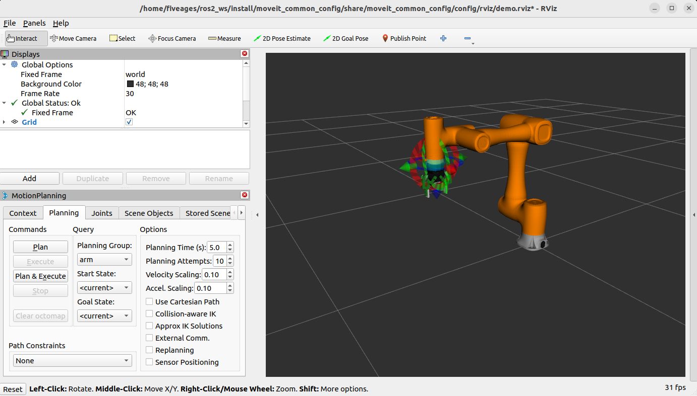
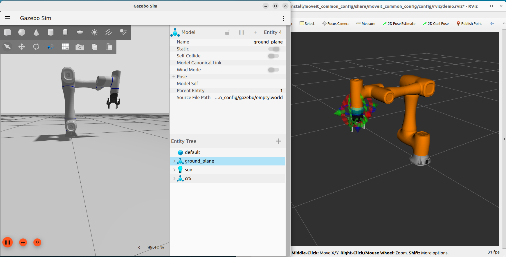
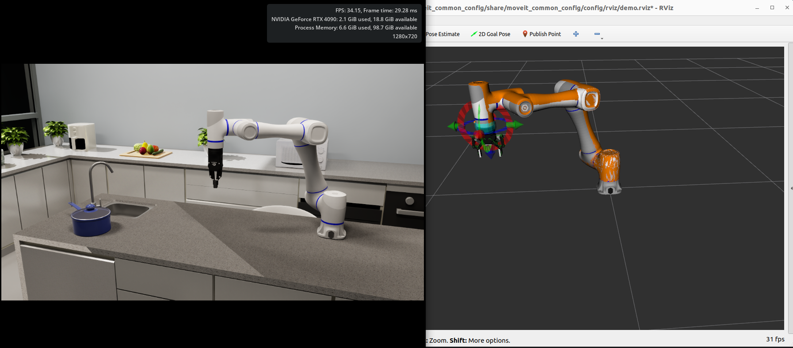

# Arms MoveIt

This repository contains MoveIt configurations for various robotic arms and common launch programs. The robot
description files are located in the [`robot_descriptions`](https://github.com/fiveages-sim/robot_descriptions).
For enhanced control capabilities, you can optionally include the [
`arms_ros2_control`](https://github.com/fiveages-sim/arms_ros2_control) package.

**Basic setup:**

```
ros2_ws
├── src
│   ├── robot_descriptions
│   └── arms_moveit
```

**Enhanced setup (recommended):**

```
ros2_ws
├── src
│   ├── robot_descriptions
│   ├── arms_moveit
│   └── arms_ros2_control  # Optional: Enhanced control packages
```

## 1. MoveIt2 Control

### 1.1 MoveIt2 Environment Setup

Please refer to
the [MoveIt2 Getting Started](https://moveit.picknik.ai/main/doc/tutorials/getting_started/getting_started.html#install-ros-2-and-colcon)
guide for installation instructions.

### 1.2 Try Your First Launch

After setting up the MoveIt2 environment, you can build and test the moveit_config packages.

* Build Dobot CR5 MoveIt2 package
    ```bash
    cd ~/ros2_ws
    colcon build --packages-up-to cr5_moveit_config --symlink-install
    ```
* Launch with mock components
    ```bash
    source ~/ros2_ws/install/setup.bash
    ros2 launch moveit_common_config demo.launch.py robot:=cr5
    ```
  

## 2. MoveIt2 with Gazebo

To launch MoveIt2 with Gazebo, you need to install Gazebo Harmonic. You can choose between the default ROS2 Gazebo
integration or the enhanced version from `arms_ros2_control`.

**Option 1: Default ROS2 Gazebo Integration**

* Use the standard ROS2 Gazebo integration. 
  ```bash
  sudo apt-get install ros-humble-gz-ros2-control
  ```

**Option 2: Enhanced gz_ros2_control (Recommended)**

* Install Gazebo Harmonic (ROS2 Humble)
    ```bash
    sudo apt-get install ros-humble-ros-gzharmonic
    ```
* The enhanced `gz_ros2_control` package is included in the `arms_ros2_control` project. Make sure you have the complete
  project structure:
    ```
    ros2_ws
    ├── src
    │   ├── robot_descriptions
    │   ├── arms_moveit
    │   └── arms_ros2_control
    │       └── hardwares
    │           └── gz_ros2_control  # (Modifed for ROS2 Humble + Gazebo Harmonic)
    ```
* Compile the enhanced gz_ros2_control package
    ```bash
    cd ~/ros2_ws
    colcon build --packages-up-to gz_ros2_control --symlink-install
    ```

* Launch MoveIt2 with Gazebo
    ```bash
    source ~/ros2_ws/install/setup.bash
    ros2 launch moveit_common_config demo.launch.py robot:=cr5 hardware:=gz
    ```

  

## 3. Moveit2 with IsaacSim

To launch MoveIt2 with Isaac Sim, you can choose between the default topic-based integration or the enhanced version
from `arms_ros2_control`.

**Option 1: Default Topic-based Integration**

* Use the standard topic-based integration 
    ```bash
  sudo apt-get install ros-humble-topic-based-ros2-control
  ```

**Option 2: Enhanced topic_based_ros2_control (Recommended)**

* The enhanced `topic_based_ros2_control` package is included in the `arms_ros2_control` project. Make sure you have the
  complete project structure:
  ```
  ros2_ws
  ├── src
  │   ├── robot_descriptions
  │   ├── arms_moveit
  │   └── arms_ros2_control
  │       └── hardwares
  │           └── topic_based_ros2_control  # Enhanced topic-based integration
  ```
* Compile the enhanced topic_based_ros2_control package
  ```bash
  cd ~/ros2_ws
  colcon build --packages-up-to topic_based_ros2_control --symlink-install
  ```

* Launch MoveIt2 with Isaac Sim (Launch Isaac Sim before this step)
  ```bash
  source ~/ros2_ws/install/setup.bash
  ros2 launch moveit_common_config demo.launch.py hardware:=isaac robot:=cr5
  ```

  

**Note**: The enhanced `topic_based_ros2_control` package provides improved safety features, including the ability to
use the robot's current position as the initial command position. This prevents sudden movements at startup and is
especially important for real hardware applications. The package includes a configurable parameter
`initialize_commands_from_state` to control this behavior.

## 4. Using MoveIt2 Servo for Teleoperation

> **How to control using joystick**:
> * `A` for switch frame between base and end-effector.
> * `X` for trigger the gripper.

* Compile moveit teleop
  ```bash
  cd ~/ros2_ws
  colcon build --packages-up-to moveit_teleop --symlink-install
  ```
* Mock Components
  ```bash
  source ~/ros2_ws/install/setup.bash
  ros2 launch moveit_common_config servo.launch.py robot:=cr5 
  ```
* Gazebo
  ```bash
  source ~/ros2_ws/install/setup.bash
  ros2 launch moveit_common_config servo.launch.py hardware:=gz robot:=cr5 
  ```
* Isaac Sim
  ```bash
  source ~/ros2_ws/install/setup.bash
  ros2 launch moveit_common_config servo.launch.py hardware:=isaac robot:=cr5 
  ```